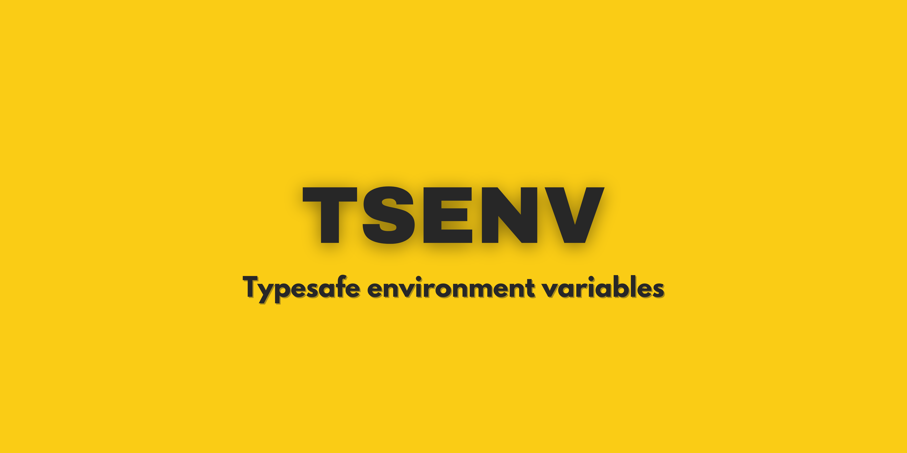

## Works with

<p align="center">
  <a href="https://nestjs.com/" target="blank" style="text-decoration: none;">
    
  </a>
  &nbsp;&nbsp;&nbsp;&nbsp;&nbsp;&nbsp;
  <a href="https://nextjs.org" target="blank">
    
  </a>
  &nbsp;&nbsp;&nbsp;&nbsp;&nbsp;&nbsp;
  <a href="https://https://trpc.io/" target="blank">
    
  </a>
  &nbsp;&nbsp;&nbsp;&nbsp;&nbsp;&nbsp;
  <a href="https://trigger.dev/" target="blank">
    
  </a>
</p>

And (probably) everything that uses environment variables.

## Table of Contents

- [Features](#features)
- [Installation](#installation)
- [Quickstart](#quickstart)
  - [Create configuration file](#create-configuration-file)
  - [Generate the typesafe client](#generate-the-typesafe-client)
  - [Client Alias](#client-alias)
  - [Use your environment variables](#use-your-environment-variables)
  - [Package.json script](#packagejson-script)
  - [.gitignore](#gitignore)
- [Variable Validation](#variable-validation)
  - [Defining the constraint and validator](#defining-the-constraint-and-validator)
  - [Using the validation](#using-the-validation)
- [Server and Client (SSR stuff)](#server-and-client-ssr-stuff)
- [Custom Loaders](#custom-loaders)
  - [Infisical adapter](#infisical-adapter)
  - [Trigger adapter](#trigger-adapter)
    - [Extension](#extension)
    - [Loader](#loader)

## Features

- Full typesafe environment variables
- Built in adapters
- Environment variable in-memory injection
- Typescript configuration file
- Functional or class based client (or injectable).

## Installation

```bash
npm install @dotsafe/dotsafe
```

```bash
pnpm install @dotsafe/dotsafe
```

```bash
yarn add @dotsafe/dotsafe
```

## Quickstart

### Create configuration file

```typescript
// env.config.ts

import { dotsafe } from "@dotsafe/dotsafe";

export default dotsafe.config({
  loader: async ({ processEnv }) => processEnv,
});
```

> [!TIP]
> For further customization of the loader see the Custom Loaders section

### Generate the typesafe client

```bash
npm dotsafe generate
```

### Client Alias

```jsonc
// tsconfig.json
{
  "compilerOptions": {
    "paths": {
      "env": ["./env.ts"],
    },
  },
}
```

### Use your environment variables

```typescript
// route.ts
import { env } from "env";
import { NextResponse } from "next/server";

export async function GET() {
  // Full intellisense 👇
  const port = env.PORT;

  return new NextResponse(port);
}
```

### Package.json script

By running your process with 'dotsafe run' you can inject the environment variables into the process, no need for `dotenv`.

All the colors and terminal output will be preserved, I'd say that even better sometimes (I got some colors working after running with `dotsafe run`).

```jsonc
// package.json
{
  "scripts": {
    "dev": "dotsafe run -g -- npm start -w",
    // The `-g` flag regenerates the client each time
    "postinstall": "dotsafe generate",
    // or 'prebuild'
    // the app won't build if the client is not generated
  },
}
```

### .gitignore

Add the generated client to your `.gitignore` file.

> [!IMPORTANT]  
> Always generate the client in the CI/CD pipeline.

```.gitignore
# .gitignore

env.ts
```

## Variable Validation

### Defining the constraint and validator

You can define agnostic constraints for you environment variables: **zod, typia, yup, valibot? Anything that returns a boolean and errors.**

> [!TIP]
> Generate the client before starting to write validation, the generated types will make it easier to define the constraints.

You don't need to validate all the variables, only the ones you want to.

Here is an example using `zod`:

```typescript
// env.config.ts
import { dotsafe } from "dotsafe";
import { z, ZodType } from "zod";
import { EnvironmentVariables } from "env";

type ZodEnv = {
  [key in EnvironmentVariables]: ZodType;
};

const envConstraint = z.object<Partial<ZodEnv>>({
  VERY_SECRET_DB_URL: z.string().regex("VERY_PUBLIC_DB_REGEX"),
});

export default dotsafe.config({
  loader: async ({ processEnv }) => processEnv,
  validate: (env) => {
    const result = envConstraint.safeParse(env);

    const isValid = result.success;

    const errors = result.error?.errors.map((error) => ({
      key: error.path.join("."),
      message: error.message,
    }));

    return {
      isValid,
      errors,
    };
  },
});
```

### Using the validation

The validation happens with a simple command call:

```bash
dotsafe validate
```

If the validation fails, the process will exit with an error code and the errors will be displayed in the console.

You can include this in your CI/CD pipeline to ensure that the environment variables are always correct before deploying.

## Server and Client (SSR stuff)

To start dealing with client and server environment variables, you need to specify your public prefix in the configuration file.

Let's say you are using `Next.js`, so your public prefix will be `NEXT_PUBLIC_`:

```typescript
// env.config.ts
import { dotsafe } from "dotsafe";

export default dotsafe.config({
  loader: async ({ processEnv }) => processEnv,
  client: {
    publicPrefix: "NEXT_PUBLIC_",
  },
});
```

From now on, whenever you generate your client, you will get a `publicEnv` object:

Server environments can't be accessed through the `publicEnv` object, and will throw an error if you try to access them on the client.

You can configure the client/server environment detection by setting the `isServer` property in the configuration file:

```typescript
// env.config.ts
import { dotsafe } from "dotsafe";

export default dotsafe.config({
  loader: async ({ processEnv }) => processEnv,
  client: {
    publicPrefix: "NEXT_PUBLIC_",
    isServer: () => typeof window === "undefined",
  },
});
```

> [!CAUTION]
> There's no way of stopping you from accessing the server variables on the server and passing them to the client via HTML or props. Be careful with sensitive data.

```typescript
// page.tsx, see that we are on server 👇 (async)

import { publicEnv } from "env";

export default async function Page() {
  // ❌ This will leak ❌
  return <div>{env.SECRET_ENV}</div>;
}
```

```typescript
// page.tsx, see that we are on client 👇

'use client'
import { publicEnv } from "env";

export default function Page() {
  useEffect(() => {
    // ✅ This will not leak ✅
    console.log(env.SECRET_ENV);
  }, [])

  // ✅ This will not leak ✅
  return <div>{env.SECRET_ENV}</div>;
}
```

## Custom Loaders

Anything you return from the loader will be injected into the environment variables, so the loader is fully customizable.

You can also use the default built-in adapters or create your own.

### Infisical adapter

```typescript
import { InfisicalSDK } from "@infisical/sdk";
import { tsenv, EnvironmentVariables } from "@ferstack/dotsafe";
import { config } from "dotenv";

export default tsenv.config({
  loader: async () => {
    const dotenv = config();

    const processEnv = dotenv.parsed as EnvironmentVariables;

    const nodeEnv = processEnv.NODE_ENV as
      | "development"
      | "preview"
      | "production";

    if (nodeEnv === "development") {
      const loader = tsenv.adapters.infisical.loader;

      const config = {
        clientId: processEnv.INFISICAL_CLIENT_ID!,
        clientSecret: processEnv.INFISICAL_CLIENT_SECRET!,
        projectId: processEnv.INFISICAL_PROJECT_ID!,
        environment: "dev",
      };

      const infisicalEnv = loader(InfisicalSDK, config);

      Object.assign(infisicalEnv, processEnv);

      return infisicalEnv;
    }

    if (nodeEnv === "preview") {
      return processEnv;
    }

    if (nodeEnv === "production") {
      return processEnv;
    }
  },
});
```

### Trigger adapter

#### Extension

When deploying to trigger you may not always deploy from your machine, where `env.ts` is already generated. In this case, to avoid build errors, you can use the provided extension:

```typescript
// trigger.config.ts
import { defineConfig } from "@trigger.dev/sdk/v3";
import { tsenv } from "@ferstack/dotsafe";

export default defineConfig({
  project: "my-project",
  build: {
    extensions: [tsenv.adapters.triggerDev.extension()],
  },
});
```

#### Loader

```typescript
// env.config.ts
import { tsenv, EnvironmentVariables } from "@ferstack/dotsafe";
import { envvars, configure } from "@trigger.dev/sdk/v3";
import { config } from "dotenv";

export default tsenv.config({
  loader: async () => {
    const dotenv = config();

    const processEnv = dotenv.parsed as EnvironmentVariables;

    const nodeEnv = processEnv.NODE_ENV;

    if (nodeEnv === "development") {
      configure({
        accessToken: processEnv.TRIGGER_ACCESS_TOKEN!,
      });

      const loader = tsenv.adapters.triggerDev.loader;

      const config = {
        projectId: processEnv.TRIGGER_PROJECT_ID!,
        environment: "dev",
      };

      const triggerEnv = loader(envvars, config);

      Object.assign(triggerEnv, processEnv);

      return triggerEnv;
    }

    if (nodeEnv === "preview" || nodeEnv === "staging") {
      return processEnv;
    }

    if (nodeEnv === "production") {
      return processEnv;
    }
  },
});
```
